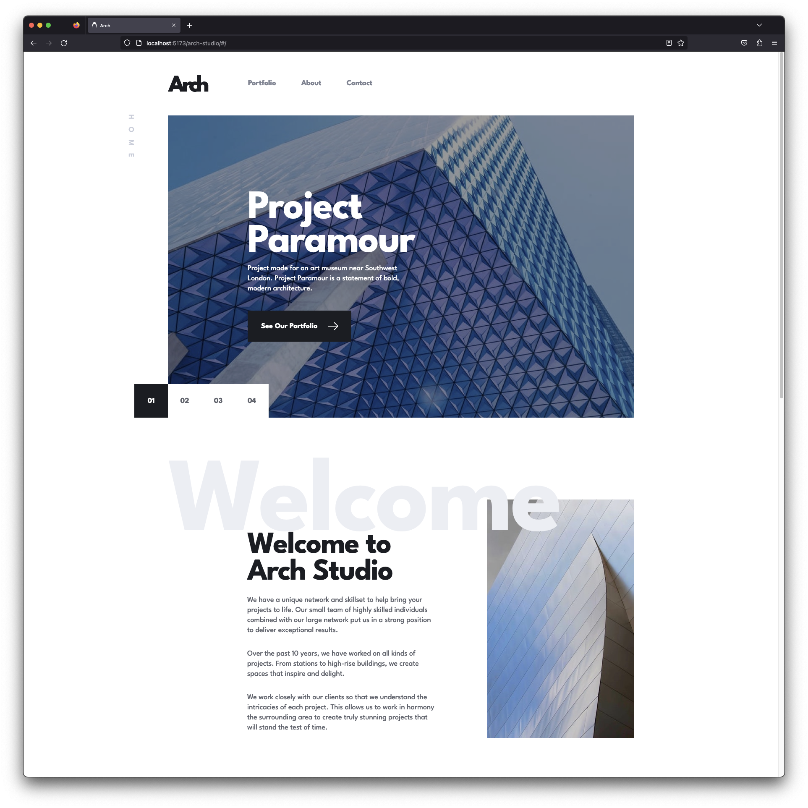

# [Frontend Mentor - Arch Studio](https://www.frontendmentor.io/challenges/arch-studio-multipage-website-wNIbOFYR6)

## Overview

-   [Live Site](https://satrop.github.io/arch-studio/#/)

## My process

### Built with ❤️

-   Semantic HTML5 markup
-   SCSS with custom properties
-   Flexbox
-   CSS Grid
-   Mobile-first workflow
-   React

Pulled data from Figma files to create an easier method for building out the swiperJS, portfolio, and leader sections. Incorporated Framer Motion for page load animations. Used react-hook-form for contact form validation. And used Leaflet for map integration.

---

### ⚠️ Todo

-   Wasn't added to work out how to get `flyTo` working so I've left out the links that are shown in the design until I can do more research on how to get `flyTo` working in ReactJS.

---

### 📝 Brief

Your challenge is to build out this multi-page website and get it looking as close to the design as possible. The download includes mobile, tablet & desktop designs for the Home, About, Portfolio, and Contact pages. A design system is also included to provide colors, fonts, etc.

You can use any tools you like to help you complete the challenge. So if you've got something you'd like to practice, feel free to give it a go.

Your users should be able to:

-   View the optimal layout for each page depending on their device's screen size
-   See hover states for all interactive elements throughout the site
-   Receive an error message when the contact form is submitted if:
    -   The Name, Email or Message fields are empty should show "Can't be empty"
    -   The Email is not formatted correctly should show "Please use a valid email address"
-   Bonus: View actual locations on the contact page map (we recommend Leaflet JS for this)
